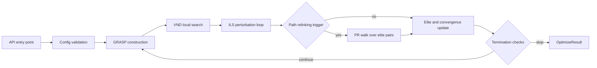
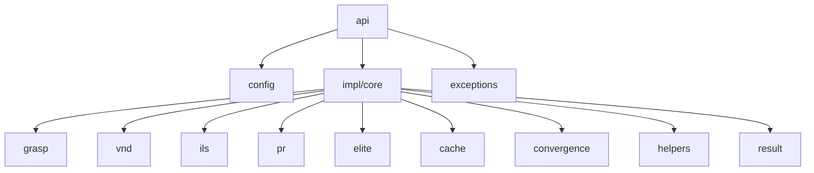
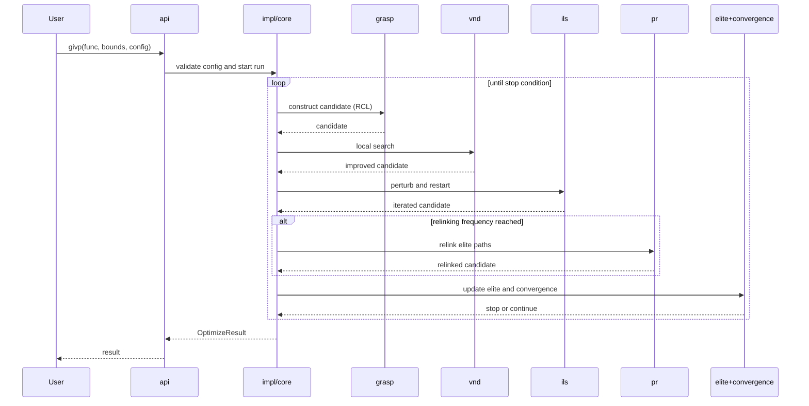

<!-- SPDX-FileCopyrightText: 2026 Arnaldo Mendes Pires Junior -->
<!-- SPDX-License-Identifier: MIT -->

# Architecture

This page describes the cross-language architecture contract for `givp`.
All ports must keep algorithm semantics and module responsibilities aligned.

## Core execution flow

## Module contract

Each language implementation mirrors the same logical modules:

| Module | Responsibility |
|---|---|
| `config` | Hyper-parameters and validation |
| `result` | Result container and termination reason |
| `exceptions` | Domain error hierarchy rooted at GivpError |
| `grasp` | Greedy randomized construction and RCL logic |
| `vnd` | Local search neighborhoods and adaptive ordering |
| `ils` | Perturbation and restart strategy |
| `pr` | Path relinking between elite solutions |
| `impl` / core | Top-level orchestration loop |
| `cache` | LRU evaluation cache |
| `elite` | Elite pool update and diversity policy |
| `convergence` | Stagnation detection and stop criteria |
| `helpers` | RNG, bounds handling, shared math |
| `api` | Public wrapper API |
| `examples.benchmark` | Reproducible benchmark functions and seed sweeps |

## Module interaction map

## One iteration sequence

## Language parity matrix

| Capability | Python | Julia | Rust | C++ | R |
|---|---|---|---|---|---|
| Public API wrapper | yes | yes | yes | yes | yes |
| GRASP + ILS + VND + PR | yes | yes | yes | yes | yes |
| Evaluation cache | yes | yes | yes | yes | yes |
| Elite pool and convergence | yes | yes | yes | yes | yes |
| Literature comparison pipeline | yes | yes | in progress | yes | partial |

## Invariants to preserve

1. Parameter names and semantics must remain aligned across language ports.
2. Termination reason mapping should be equivalent across public APIs.
3. Benchmark protocol should use the same objective set and seed strategy.
4. Changes in one port that alter behavior should be mirrored in others.

## Where to look first

1. Start at each language public API entry point.
2. Follow the call chain into the orchestrator (`impl`/core).
3. Confirm call order of GRASP -> VND -> ILS -> PR.
4. Validate that result and termination fields match the shared contract.
