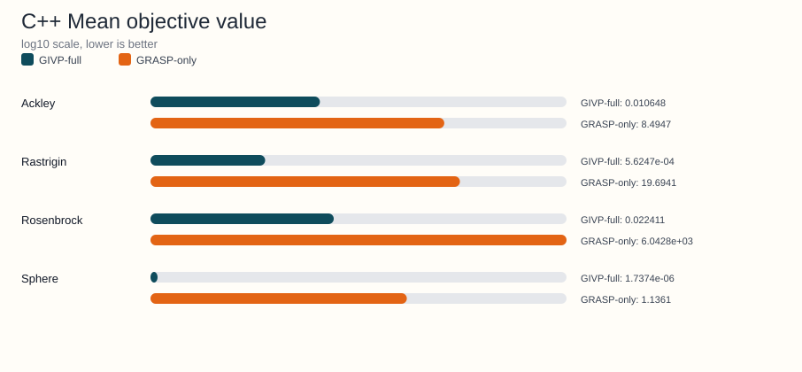
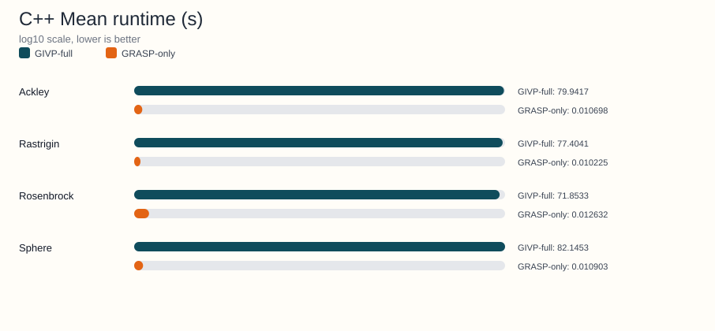

<!-- Generated by python benchmarks/publish_docs_artifacts.py; do not edit manually. -->
# C++ benchmark artifact

Source JSON: [Notebooks/Cpp/benchmark_literature_comparison_cpp_results.json](https://github.com/Arnime/grasp_ils_vnd_pr/blob/main/Notebooks/Cpp/benchmark_literature_comparison_cpp_results.json)

## Metadata

- Dimensions: 10
- Independent runs: 30
- Algorithms: GIVP-full, GRASP-only
- Functions: Ackley, Rastrigin, Rosenbrock, Sphere

## Regenerate

```bash
python benchmarks/publish_docs_artifacts.py
```

## Generated charts





## Function-level summary

| Function | GIVP-full mean +- std | GRASP-only mean +- std | Runtime ratio (GIVP-full/GRASP-only) |
|---|---|---|---|
| Ackley | 0.010648 +- 0.001939 | 8.4947 +- 1.1307 | 7472.42x |
| Rastrigin | 5.6247e-04 +- 1.9117e-04 | 19.6941 +- 2.8138 | 7569.76x |
| Rosenbrock | 0.022411 +- 0.008175 | 6.0428e+03 +- 4.0905e+03 | 5688.11x |
| Sphere | 1.7374e-06 +- 5.1980e-07 | 1.1361 +- 0.408387 | 7533.89x |

## Detailed summary rows

| Function | Algorithm | Mean +- std | Median | Mean nfev | Mean time (s) |
|---|---|---|---|---|---|
| Ackley | GIVP-full | 0.010648 +- 0.001939 | 0.011009 | 2.0446e+07 | 79.9417 |
| Ackley | GRASP-only | 8.4947 +- 1.1307 | 8.8055 | 4.2515e+03 | 0.010698 |
| Rastrigin | GIVP-full | 5.6247e-04 +- 1.9117e-04 | 5.6499e-04 | 2.0187e+07 | 77.4041 |
| Rastrigin | GRASP-only | 19.6941 +- 2.8138 | 19.8087 | 4.3314e+03 | 0.010225 |
| Rosenbrock | GIVP-full | 0.022411 +- 0.008175 | 0.022461 | 1.8808e+07 | 71.8533 |
| Rosenbrock | GRASP-only | 6.0428e+03 +- 4.0905e+03 | 5.4019e+03 | 4.2389e+03 | 0.012632 |
| Sphere | GIVP-full | 1.7374e-06 +- 5.1980e-07 | 1.7674e-06 | 2.0389e+07 | 82.1453 |
| Sphere | GRASP-only | 1.1361 +- 0.408387 | 1.1412 | 4.2336e+03 | 0.010903 |
