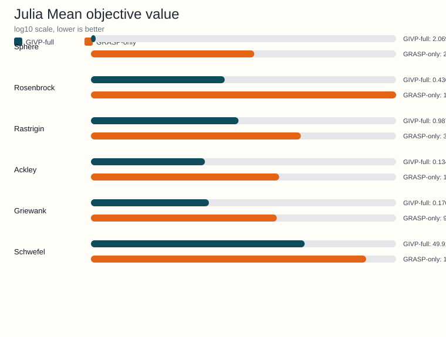

<!-- Generated by python -m benchmarks.publishing --repo-root .. --output-dir ../docs/examples/benchmark-reports; do not edit manually. -->
# Julia benchmark artifact

Source JSON: [Notebooks/Julia/results_notebook_julia.json](https://github.com/Arnime/givp/blob/main/Notebooks/Julia/results_notebook_julia.json)

## Metadata

- Dimensions: 10
- Independent runs: 30
- Algorithms: GIVP-full, GRASP-only
- Functions: Sphere, Rosenbrock, Rastrigin, Ackley, Griewank, Schwefel

## Regenerate

```bash
python -m benchmarks.publishing --repo-root .. --output-dir ../docs/examples/benchmark-reports
```

## Generated charts



Runtime mean was not present in the source summary, so no runtime SVG
was generated for this artifact.

## Function-level summary

| Function | GIVP-full mean +- std | GRASP-only mean +- std | Runtime ratio (GIVP-full/GRASP-only) |
|---|---|---|---|
| Sphere | 2.0692e-04 +- 6.3134e-05 | 2.5144 +- 0.565311 | - |
| Rosenbrock | 0.436108 +- 0.319655 | 1.1314e+04 +- 5.7702e+03 | - |
| Rastrigin | 0.987939 +- 0.607264 | 39.8752 +- 7.4324 | - |
| Ackley | 0.134946 +- 0.026316 | 10.9925 +- 0.798337 | - |
| Griewank | 0.170852 +- 0.037264 | 9.5772 +- 1.7650 | - |
| Schwefel | 49.9155 +- 77.3378 | 1.9143e+03 +- 162.99 | - |

## Detailed summary rows

| Function | Algorithm | Mean +- std | Median | Mean nfev | Mean time (s) |
|---|---|---|---|---|---|
| Ackley | GIVP-full | 0.134946 +- 0.026316 | 0.131922 | 6.1813e+05 | - |
| Ackley | GRASP-only | 10.9925 +- 0.798337 | 11.1723 | 2.5549e+03 | - |
| Griewank | GIVP-full | 0.170852 +- 0.037264 | 0.170577 | 6.1737e+05 | - |
| Griewank | GRASP-only | 9.5772 +- 1.7650 | 9.8980 | 2.5523e+03 | - |
| Rastrigin | GIVP-full | 0.987939 +- 0.607264 | 1.0140 | 5.7054e+05 | - |
| Rastrigin | GRASP-only | 39.8752 +- 7.4324 | 41.8666 | 2.5750e+03 | - |
| Rosenbrock | GIVP-full | 0.436108 +- 0.319655 | 0.392156 | 8.3564e+05 | - |
| Rosenbrock | GRASP-only | 1.1314e+04 +- 5.7702e+03 | 1.0644e+04 | 2.5381e+03 | - |
| Schwefel | GIVP-full | 49.9155 +- 77.3378 | 1.3460e-04 | 5.8483e+05 | - |
| Schwefel | GRASP-only | 1.9143e+03 +- 162.99 | 1.9383e+03 | 2.5838e+03 | - |
| Sphere | GIVP-full | 2.0692e-04 +- 6.3134e-05 | 2.1925e-04 | 6.0097e+05 | - |
| Sphere | GRASP-only | 2.5144 +- 0.565311 | 2.6281 | 2.5525e+03 | - |
