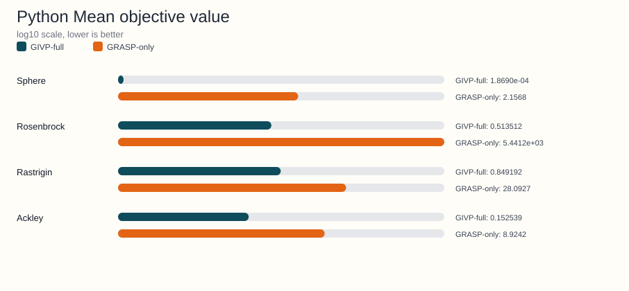
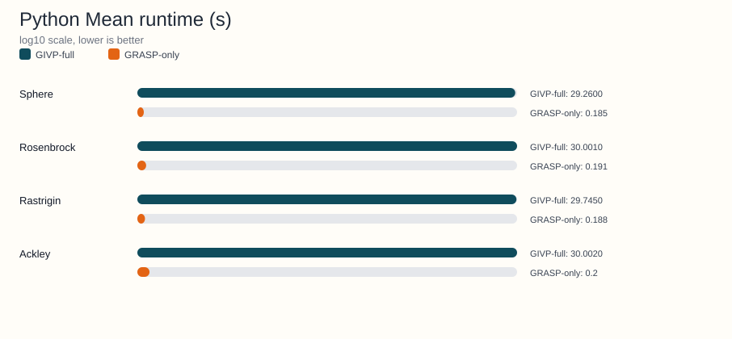

<!-- Generated by python -m benchmarks.publishing --repo-root .. --output-dir ../docs/examples/benchmark-reports; do not edit manually. -->
# Python benchmark artifact

Source JSON: [Notebooks/Python/benchmark_literature_comparison_results.json](https://github.com/Arnime/givp/blob/main/Notebooks/Python/benchmark_literature_comparison_results.json)

## Metadata

- Dimensions: 10
- Independent runs: 30
- Algorithms: GIVP-full, GRASP-only
- Functions: Sphere, Rosenbrock, Rastrigin, Ackley

## Regenerate

```bash
python -m benchmarks.publishing --repo-root .. --output-dir ../docs/examples/benchmark-reports
```

## Generated charts





## Function-level summary

| Function | GIVP-full mean +- std | GRASP-only mean +- std | Runtime ratio (GIVP-full/GRASP-only) |
|---|---|---|---|
| Sphere | 1.8690e-04 +- 5.7689e-05 | 2.1568 +- 0.482714 | 158.16x |
| Rosenbrock | 0.513512 +- 0.325223 | 5.4412e+03 +- 2.2323e+03 | 157.07x |
| Rastrigin | 0.849192 +- 0.624725 | 28.0927 +- 4.9224 | 158.22x |
| Ackley | 0.152539 +- 0.027741 | 8.9242 +- 1.0037 | 150.01x |

## Detailed summary rows

| Function | Algorithm | Mean +- std | Median | Mean nfev | Mean time (s) |
|---|---|---|---|---|---|
| Ackley | GIVP-full | 0.152539 +- 0.027741 | 0.150154 | 4.7784e+05 | 30.0020 |
| Ackley | GRASP-only | 8.9242 +- 1.0037 | 9.2427 | 4.8520e+03 | 0.2 |
| Rastrigin | GIVP-full | 0.849192 +- 0.624725 | 1.0144 | 5.2482e+05 | 29.7450 |
| Rastrigin | GRASP-only | 28.0927 +- 4.9224 | 29.2184 | 4.8980e+03 | 0.188 |
| Rosenbrock | GIVP-full | 0.513512 +- 0.325223 | 0.509999 | 5.7176e+05 | 30.0010 |
| Rosenbrock | GRASP-only | 5.4412e+03 +- 2.2323e+03 | 5.3735e+03 | 4.8340e+03 | 0.191 |
| Sphere | GIVP-full | 1.8690e-04 +- 5.7689e-05 | 1.9862e-04 | 6.0563e+05 | 29.2600 |
| Sphere | GRASP-only | 2.1568 +- 0.482714 | 2.1947 | 4.8280e+03 | 0.185 |
