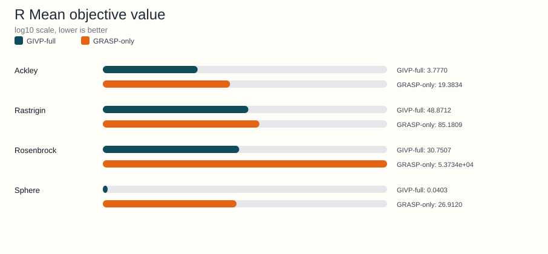

<!-- Generated by python benchmarks/publish_docs_artifacts.py; do not edit manually. -->
# r benchmark artifact

Source JSON: [results/dissertacao/2026-05-19/r/literature_comparison.json](https://github.com/Arnime/grasp_ils_vnd_pr/blob/main/results/dissertacao/2026-05-19/r/literature_comparison.json)

## Metadata

- Dimensions: 10
- Independent runs: 30
- Algorithms: GIVP-full, DE, PSO, GA, CMA-ES, SA
- Functions: Sphere, Rosenbrock, Rastrigin, Ackley, Griewank, Schwefel

## Regenerate

```bash
python benchmarks/publish_docs_artifacts.py
```

## Generated charts



Runtime mean was not present in the source summary, so no runtime SVG
was generated for this artifact.

## Function-level summary

| Function | GIVP-full mean +- std | DE mean +- std | Runtime ratio (GIVP-full/DE) |
|---|---|---|---|
| Sphere | 0.02412 +- 0.00814 | 1.5795e-07 +- 6.2500e-08 | - |
| Rosenbrock | 21.3172 +- 6.1777 | 5.5605 +- 0.836914 | - |
| Rastrigin | 40.6994 +- 6.4975 | 5.1061 +- 1.1005 | - |
| Ackley | 3.1756 +- 0.485256 | 0.004527 +- 0.001145 | - |
| Griewank | 1.0851 +- 0.060464 | 0.191954 +- 0.048416 | - |
| Schwefel | 971.28 +- 189.26 | 21.8683 +- 27.4902 | - |

## Detailed summary rows

| Function | Algorithm | Mean +- std | Median | Mean nfev | Mean time (s) |
|---|---|---|---|---|---|
| Ackley | CMA-ES | 16.3594 +- 7.4382 | 19.6313 | 2.0000e+03 | - |
| Ackley | DE | 0.004527 +- 0.001145 | 0.00437 | 2.0100e+04 | - |
| Ackley | GA | 0.313041 +- 0.35131 | 0.201823 | 1.6412e+04 | - |
| Ackley | GIVP-full | 3.1756 +- 0.485256 | 3.1874 | 1.0590e+04 | - |
| Ackley | PSO | 0.002993 +- 0.002192 | 0.002509 | 3.2000e+03 | - |
| Ackley | SA | 20.4637 +- 0.336786 | 20.5549 | 200.00 | - |
| Griewank | CMA-ES | 0.00802 +- 0.00727 | 0.009092 | 2.0000e+03 | - |
| Griewank | DE | 0.191954 +- 0.048416 | 0.191587 | 2.0100e+04 | - |
| Griewank | GA | 0.549157 +- 0.141977 | 0.521106 | 1.6412e+04 | - |
| Griewank | GIVP-full | 1.0851 +- 0.060464 | 1.0888 | 1.4343e+04 | - |
| Griewank | PSO | 0.290071 +- 0.150101 | 0.285871 | 3.2000e+03 | - |
| Griewank | SA | 338.71 +- 96.7493 | 327.32 | 200.00 | - |
| Rastrigin | CMA-ES | 29.5283 +- 26.3462 | 20.4061 | 2.0000e+03 | - |
| Rastrigin | DE | 5.1061 +- 1.1005 | 5.3040 | 2.0100e+04 | - |
| Rastrigin | GA | 1.2329 +- 1.0672 | 1.1947 | 1.6412e+04 | - |
| Rastrigin | GIVP-full | 40.6994 +- 6.4975 | 42.3436 | 1.1009e+04 | - |
| Rastrigin | PSO | 13.5158 +- 6.1137 | 13.1679 | 3.2000e+03 | - |
| Rastrigin | SA | 109.92 +- 31.0459 | 109.78 | 200.00 | - |
| Rosenbrock | CMA-ES | 13.2001 +- 24.3158 | 5.7687 | 2.0000e+03 | - |
| Rosenbrock | DE | 5.5605 +- 0.836914 | 5.4279 | 2.0100e+04 | - |
| Rosenbrock | GA | 13.5630 +- 13.8934 | 8.8494 | 1.6412e+04 | - |
| Rosenbrock | GIVP-full | 21.3172 +- 6.1777 | 20.1177 | 1.8890e+04 | - |
| Rosenbrock | PSO | 9.6750 +- 16.4201 | 6.9454 | 3.2000e+03 | - |
| Rosenbrock | SA | 1.6252e+03 +- 3.5739e+03 | 394.54 | 200.00 | - |
| Schwefel | CMA-ES | 1.7080e+03 +- 369.55 | 1.6841e+03 | 2.0000e+03 | - |
| Schwefel | DE | 21.8683 +- 27.4902 | 12.0551 | 2.0100e+04 | - |
| Schwefel | GA | 345.12 +- 169.92 | 355.47 | 1.6412e+04 | - |
| Schwefel | GIVP-full | 971.28 +- 189.26 | 951.97 | 8.9571e+03 | - |
| Schwefel | PSO | 706.36 +- 253.28 | 703.91 | 3.2000e+03 | - |
| Schwefel | SA | 3.8899e+03 +- 625.81 | 3.9992e+03 | 200.00 | - |
| Sphere | CMA-ES | 1.4141e-11 +- 1.7787e-11 | 8.5936e-12 | 2.0000e+03 | - |
| Sphere | DE | 1.5795e-07 +- 6.2500e-08 | 1.4869e-07 | 2.0100e+04 | - |
| Sphere | GA | 0.001339 +- 0.001141 | 9.8059e-04 | 1.6412e+04 | - |
| Sphere | GIVP-full | 0.02412 +- 0.00814 | 0.022868 | 2.0746e+04 | - |
| Sphere | PSO | 8.1277e-08 +- 8.7025e-08 | 4.4344e-08 | 3.2000e+03 | - |
| Sphere | SA | 7.7497 +- 4.0164 | 6.1984 | 200.00 | - |
