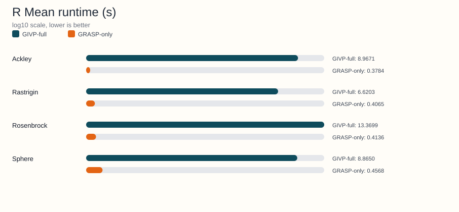

<!-- Generated by python benchmarks/publish_docs_artifacts.py; do not edit manually. -->
# R benchmark artifact

Source JSON: [Notebooks/R/benchmark_literature_comparison_r_results.json](https://github.com/Arnime/grasp_ils_vnd_pr/blob/main/Notebooks/R/benchmark_literature_comparison_r_results.json)

## Metadata

- Dimensions: 10
- Independent runs: 5
- Algorithms: GIVP-full, GRASP-only
- Functions: Ackley, Rastrigin, Rosenbrock, Sphere

## Regenerate

```bash
python benchmarks/publish_docs_artifacts.py
```

## Generated charts




## Function-level summary

| Function | GIVP-full mean +- std | GRASP-only mean +- std | Runtime ratio (GIVP-full/GRASP-only) |
|---|---|---|---|
| Ackley | 3.7770 +- 0.4828 | 19.3834 +- 0.3657 | 23.70x |
| Rastrigin | 48.8712 +- 6.7673 | 85.1809 +- 13.9539 | 16.29x |
| Rosenbrock | 30.7507 +- 12.2042 | 5.3734e+04 +- 2.2511e+04 | 32.33x |
| Sphere | 0.0403 +- 0.0178 | 26.9120 +- 7.1326 | 19.41x |

## Detailed summary rows

| Function | Algorithm | Mean +- std | Median | Mean nfev | Mean time (s) |
|---|---|---|---|---|---|
| Ackley | GIVP-full | 3.7770 +- 0.4828 | 3.6029 | 8.1828e+03 | 8.9671 |
| Ackley | GRASP-only | 19.3834 +- 0.3657 | 19.5540 | 754.00 | 0.3784 |
| Rastrigin | GIVP-full | 48.8712 +- 6.7673 | 48.8383 | 6.1080e+03 | 6.6203 |
| Rastrigin | GRASP-only | 85.1809 +- 13.9539 | 75.5868 | 757.60 | 0.4065 |
| Rosenbrock | GIVP-full | 30.7507 +- 12.2042 | 23.9709 | 1.0492e+04 | 13.3699 |
| Rosenbrock | GRASP-only | 5.3734e+04 +- 2.2511e+04 | 5.4448e+04 | 741.80 | 0.4136 |
| Sphere | GIVP-full | 0.0403 +- 0.0178 | 0.0392 | 1.0295e+04 | 8.8650 |
| Sphere | GRASP-only | 26.9120 +- 7.1326 | 24.2945 | 754.00 | 0.4568 |
