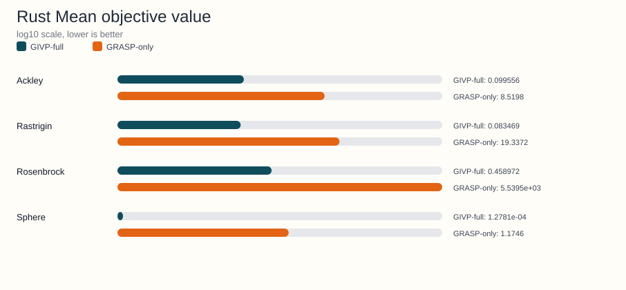
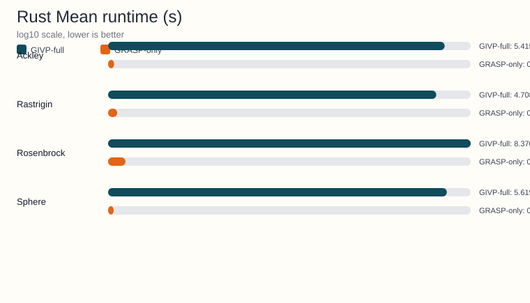

<!-- Generated by python benchmarks/publish_docs_artifacts.py; do not edit manually. -->
# Rust benchmark artifact

Source JSON: [Notebooks/Rust/benchmark_literature_comparison_rust_results.json](https://github.com/Arnime/grasp_ils_vnd_pr/blob/main/Notebooks/Rust/benchmark_literature_comparison_rust_results.json)

## Metadata

- Dimensions: 10
- Independent runs: 30
- Algorithms: GIVP-full, GRASP-only
- Functions: Ackley, Rastrigin, Rosenbrock, Sphere

## Regenerate

```bash
python benchmarks/publish_docs_artifacts.py
```

## Generated charts





## Function-level summary

| Function | GIVP-full mean +- std | GRASP-only mean +- std | Runtime ratio (GIVP-full/GRASP-only) |
|---|---|---|---|
| Ackley | 0.099556 +- 0.025989 | 8.5198 +- 0.998958 | 249.00x |
| Rastrigin | 0.083469 +- 0.046006 | 19.3372 +- 4.2390 | 205.57x |
| Rosenbrock | 0.458972 +- 0.14378 | 5.5395e+03 +- 2.9638e+03 | 318.50x |
| Sphere | 1.2781e-04 +- 4.6940e-05 | 1.1746 +- 0.462168 | 260.34x |

## Detailed summary rows

| Function | Algorithm | Mean +- std | Median | Mean nfev | Mean time (s) |
|---|---|---|---|---|---|
| Ackley | GIVP-full | 0.099556 +- 0.025989 | 0.103326 | 8.4990e+05 | 5.4157 |
| Ackley | GRASP-only | 8.5198 +- 0.998958 | 8.5837 | 4.2262e+03 | 0.021749 |
| Rastrigin | GIVP-full | 0.083469 +- 0.046006 | 0.066884 | 8.1149e+05 | 4.7081 |
| Rastrigin | GRASP-only | 19.3372 +- 4.2390 | 18.8709 | 4.3158e+03 | 0.022903 |
| Rosenbrock | GIVP-full | 0.458972 +- 0.14378 | 0.446324 | 1.1233e+06 | 8.3703 |
| Rosenbrock | GRASP-only | 5.5395e+03 +- 2.9638e+03 | 4.8410e+03 | 4.2252e+03 | 0.02628 |
| Sphere | GIVP-full | 1.2781e-04 +- 4.6940e-05 | 1.2926e-04 | 8.4083e+05 | 5.6198 |
| Sphere | GRASP-only | 1.1746 +- 0.462168 | 1.1820 | 4.2408e+03 | 0.021587 |
